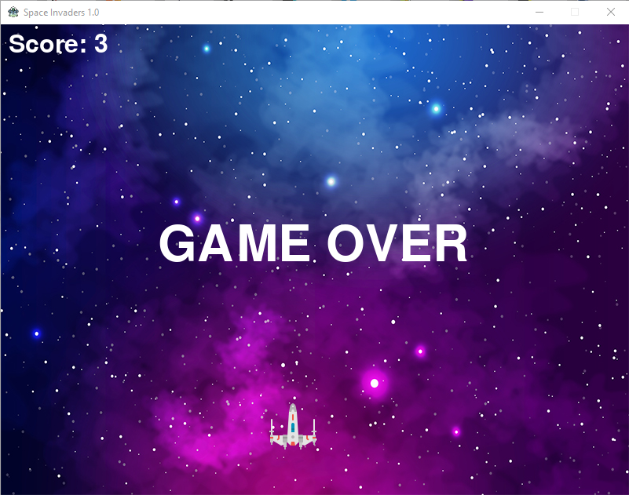

<h1>Space Invaders Game:</h1>
  In order to run the game install all dependencies listed in requirements.txt (the sample command to install is 'pip install <name_of_the package>'). Then in the terminal run the command <code>python3 main.py</code> or <code>python main.py</code> in Windows command prompt.
Here is how the game looks like:
</img>
</img>

In order to test the project run the command:
<code>python3 test/main_test.py -v</code> in terminal
<code>python test/main_test.py -v</code> in Windows command prompt

Have a nice time ;)
